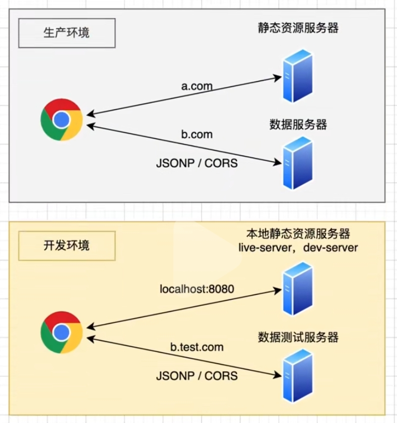
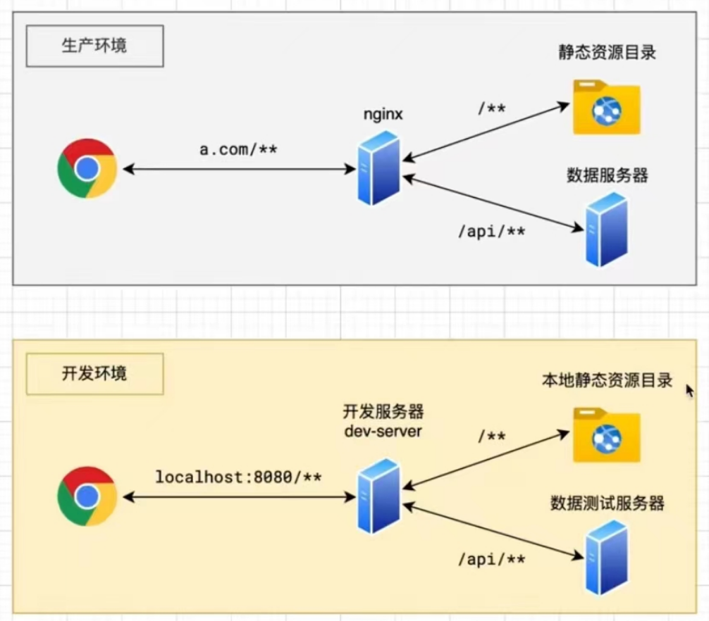

# 跨域方案的抉择

跨域方案有很多，最常用的是 CORS 和 代理。

到底使用 CORS 还是 代理？

我们首先要看生产环境是什么情况，然后把生产环境的解决方案照搬到开发环境。

需要牢记的一点是：**本地开发环境使用的跨域方案是完全取决于生产环境是什么样子的**。

## 使用 CORS 的场景

如果生产环境是这样的情况：前端代码通过打包后上传到了静态资源服务器，我们通过 a.com 访问静态资源服务器去拿 js 等资源，运行 js 的过程中，ajax 请求通过 b.com 去请求数据服务器。这种场景一般使用 CORS（老浏览器使用 JSONP）。

## 使用 代理 的场景

如果生产环境是这样的情况：前端代码打包后上传到服务器的一个静态资源目录，而后端写的程序也在服务器上跑了起来。在这两者之前，搭了一个 nginx 反向代理服务器。用户通过浏览器只去访问这个 nginx，并不是直接去访问这个资源，通过 nginx 的转发帮我们代理这些资源。
即，我们是通过 a.com 去访问页面，通过 a.com/api/xxx 去请求接口。这里的 a.com 会被代理到静态资源目录去请求静态资源，a.com/api/xxx 会被代理到数据服务器去请求数据。这种场景下，对浏览器而言是没有发生跨域的，因为使用的是同一个域名。

这种场景下，前端开发环境下的跨域需要自行通过代理（devServer.proxy）解决。

