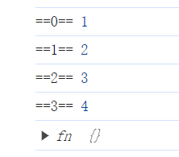

# 手写 bind 函数

## 知识点

1. new.target 属性允许你检测函数或构造方法是否是通过 new 运算符被调用的。在通过 new 运算符被初始化的函数或构造方法中，new.target 返回一个指向构造方法或函数的引用。在普通的函数调用中，new.target 的值是 undefined。

```js
Function.prototype.myBind = function (ctx, ...args) {
  const fn = this;

  return function (...restArgs) {
    /* 如果是通过 new 创建对象，那么就 new 一个对象返回 */
    if (new.target) {
      return new fn(...args, ...restArgs);
    }
    return fn.apply(ctx, [...args, ...restArgs]);
  };
};
```

## 测试

```js
function fn(...args) {
  console.log("==0==", args[0]);
  console.log("==1==", args[1]);
  console.log("==2==", args[2]);
  console.log("==3==", args[3]);
}

const newFn = fn.myBind("ctx", 1, 2);
console.log(new newFn(3, 4));
```

结果：

