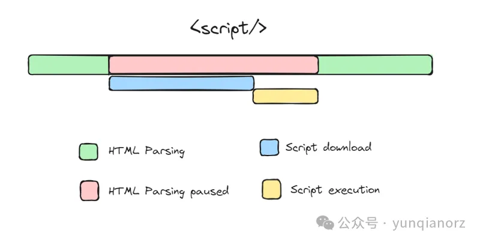
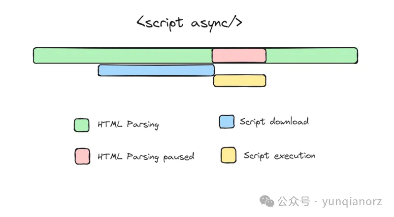
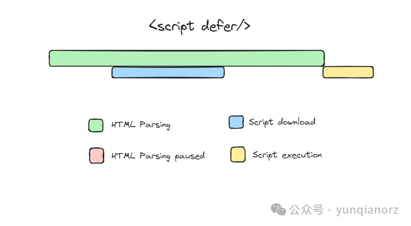

# 三张图让你了解 async 和 defer 的区别

> [仅需 10 秒，三张图让你了解 async 和 defer 的区别](https://mp.weixin.qq.com/s?__biz=MjM5NDgyODI4MQ==&mid=2247487275&idx=1&sn=5884f70cf1d201ef1fdae8f2b27f7d84)

大家好！希望你们一切安好。这篇文章将探讨一个有趣的 Javascript 话题。async 和 defer 是在 HTML 文档中包含外部 JavaScript 文件时使用的属性。它们影响浏览器加载和执行脚本的方式。让我们详细了解它们。

## 默认行为

我们通常使用 `<script>` 标签将 HTML 页面与外部 javascript 连接。传统上，JavaScript 的 `<script>` 标签经常放置在 HTML 文档的 `<head>` 部分。然而，这样做意味着在获取并执行 JavaScript 文件之前，HTML 的解析会被阻塞，导致页面加载时间变长。如今，我们大多更倾向于把 `<script>` 标签放在 `<body>` 元素的所有内容之后。

```html
<script src="example.js"></script>
```

这里是 HTML 解析和脚本执行的过程。


## Async

当我们使用 `async` 属性包含脚本时，它告诉浏览器在解析 HTML 文档的同时异步下载脚本。脚本在后台下载，不会阻塞 HTML 解析过程。

一旦脚本下载完成，它会被异步执行，这意味着它可以在任何时候运行，甚至在 HTML 文档解析完成之前。

```html
<script src="example.js" async></script>
```

如果多个脚本被设置为异步加载，它们会在**下载完毕后立即执行，而不考虑它们在文档中的顺序**。这在脚本不依赖于 DOM 完全加载或其他脚本时非常有用。


## Defer

当我们使用带有 `defer` 属性的脚本标签时，它也会告诉浏览器在解析 HTML 文档的同时异步下载脚本。然而，**脚本的执行会被推迟到 HTML 文档解析完成之后**。

```html
<script src="example.js" defer></script>
```

带有 defer 属性的脚本**会按照它们在文档中出现的顺序执行**。当脚本依赖于 DOM 完全解析完成或者脚本执行顺序很重要时，这种方式非常有用。


## 结论

无论是 `async` 还是 `defer` 属性，都允许 HTML 解析过程在不等待脚本下载的情况下继续进行。

两者的区别在于脚本执行的时机：

- **使用 async 属性，脚本会在下载完马上执行，可能会在 HTML 文档完全解析之前**。
- **而使用 defer 属性，脚本只会在 HTML 文档完全解析之后、DOMContentLoaded 事件之前执行**。

需要注意的一点是，我们应当：

- **仅在脚本可以独立运行且不依赖于 DOM 结构时使用 async**。
- **在需要保持脚本执行顺序或依赖于 DOM 结构时使用 defer**。
