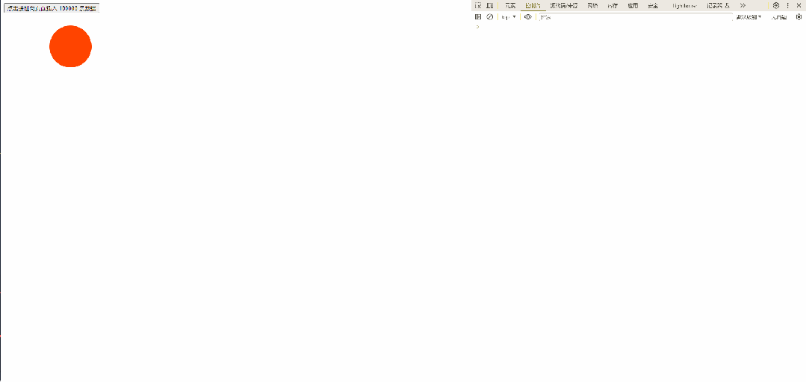

# JS 分片任务的高阶函数封装

> https://mp.weixin.qq.com/s/OUpbzotUAiG8wHREH7hBww

## 场景复现

我们看一段代码：

```html
<!DOCTYPE html>
<html lang="en">
  <head>
    <meta charset="UTF-8" />
    <meta http-equiv="X-UA-Compatible" content="IE=edge" />
    <meta name="viewport" content="width=device-width, initial-scale=1.0" />
    <title>分片任务的高阶函数封装</title>
    <style>
      .ball {
        width: 100px;
        height: 100px;
        background: #f40;
        border-radius: 50%;
        margin: 30px;
      }

      .ball1 {
        position: absolute;
        left: 0;
        animation: move1 1s alternate infinite ease-in-out;
      }

      @keyframes move1 {
        to {
          left: 100px;
        }
      }
    </style>
  </head>

  <body>
    <button class="btn">点击按钮向页面插入 100000 条数据</button>
    <div class=" ball ball1"></div>
    <script>
      const btn = document.querySelector(".btn");
      const datas = new Array(100000).fill(0).map((_, i) => i);
      btn.onclick = () => {
        // 记录开始时间
        console.time("耗时");
        for (const i of datas) {
          const div = document.createElement("div");
          div.innerText = i;
          document.body.appendChild(div);
        }
        console.timeEnd("耗时");
      };
    </script>
  </body>
</html>
```



这里的小球动画是为了演示浏览器的卡顿效果，我们可以看到，直接向页面插入 100000 条元素，页面会直接卡死，等渲染完才正常，为什么会这样呢？

## 问题本质

这是因为浏览器的渲染频率一般是 `60Hz`,也是目前主流显示屏的频率。**60Hz 表示计算机一秒钟要渲染 60 帧画面,所以渲染一帧或者说每一片段所需时间就是 1/60 = 16.6ms**

但是现在这个任务的执行时间比较长，导致这个任务没有给浏览器留出足够的空间进行渲染，导致渲染任务延后执行，这就是页面卡死的原因。这就涉及到浏览器的渲染原理了，有关这方面的知识可以看下我之前发过的文章：现在浏览器的渲染原理及流程

## 问题分解

我们已经知道问题产生的原因，那我们怎么优化呢？**解决办法就是给这些任务分片执行，让任务一段一段执行，这样我们就看不到页面卡顿了。**

这里我们就涉及到两个问题：

- 下一次分片什么时候开始？
- 每一次分片执行多少

这里我们就要用到一个 API ：`requestIdleCallback`

这个函数将在浏览器空闲时期被调用。这使开发者能够在主事件循环上执行后台和低优先级工作，而不会影响延迟关键事件，如动画和输入响应。函数一般会按先进先调用的顺序执行，然而，如果回调函数指定了执行超时时间 timeout，则有可能为了在超时前执行函数而打乱执行顺序。

## 代码优化

我们要实现一个分片函数，让它帮我们执行任务：

```html
<!DOCTYPE html>
<html lang="en">
  <head>
    <meta charset="UTF-8" />
    <meta http-equiv="X-UA-Compatible" content="IE=edge" />
    <meta name="viewport" content="width=device-width, initial-scale=1.0" />
    <title>分片任务的高阶函数封装</title>
    <style>
      .ball {
        width: 100px;
        height: 100px;
        background: #f40;
        border-radius: 50%;
        margin: 30px;
      }

      .ball1 {
        position: absolute;
        left: 0;
        animation: move1 1s alternate infinite ease-in-out;
      }

      @keyframes move1 {
        to {
          left: 100px;
        }
      }
    </style>
  </head>

  <body>
    <button class="btn">点击按钮向页面插入 100000 条数据</button>
    <div class=" ball ball1"></div>
    <script>
      const btn = document.querySelector(".btn");
      const datas = new Array(100000).fill(0).map((_, i) => i);
      btn.onclick = () => {
        // 记录开始时间
        console.time("耗时");
        performChunk(datas);
        console.timeEnd("耗时");
      };

      const performChunk = (datas) => {
        // 边界判定
        if (datas.length === 0) {
          return;
        }
        let i = 0;
        // 开启下一个分片的执行
        function _run() {
          // 边界判定
          if (i >= datas.length) {
            return;
          }
          // 一个渲染帧中，空闲时开启分片执行
          requestIdleCallback((idle) => {
            // timeRemaining 表示当前闲置周期的预估剩余毫秒数
            while (idle.timeRemaining() > 0 && i < datas.length) {
              // 分片执行的任务
              const div = document.createElement("div");
              div.innerText = i;
              document.body.appendChild(div);
              i++;
            }
            // 此次分片完成
            _run();
          });
        }
        _run();
      };
    </script>
  </body>
</html>
```


这里就没有明显的卡顿效果了，这是因为浏览器把这些任务分片执行了，比如说前面执行 100 次，然后再接着执行 100 次，所以现在的渲染效率就比较高了。

## 封装高阶函数

这里我们已经完成这项任务的分片执行，但我们希望这个分片函数针对的不仅仅是这个任务，它应该是通用的，所以我们要提取一些操作，让用户自己去执行，比如说：

- 具体任务的执行过程
- 分片任务执行的时机？每一次具体分片多少？
- 如果是 node 环境呢？

这些都应该由开发者去定义，基于这些，我们封装成一个更加通用的高阶函数：

```html
<!DOCTYPE html>
<html lang="en">
  <head>
    <meta charset="UTF-8" />
    <meta http-equiv="X-UA-Compatible" content="IE=edge" />
    <meta name="viewport" content="width=device-width, initial-scale=1.0" />
    <title>分片任务的高阶函数封装</title>
  </head>

  <body>
    <button class="btn">点击按钮向页面插入 100000 条数据</button>
    <script>
      const btn = document.querySelector(".btn");
      btn.onclick = () => {
        // 自定义执行过程
        const taskHandler = (_, i) => {
          const div = document.createElement("div");
          div.innerText = i;
          document.body.appendChild(div);
        };
        broswerPerformChunk(10000, taskHandler);
      };

      const performChunk = (datas, taskHandler, scheduler) => {
        if (typeof datas === "number") {
          datas = {
            length: datas,
          };
        }
        // 边界判定
        if (datas.length === 0) {
          return;
        }
        let i = 0;
        // 开启下一个分片的执行
        function _run() {
          // 边界判定
          if (i >= datas.length) {
            return;
          }
          // goOn 判断是否还继续执行
          scheduler((goOn) => {
            // timeRemaining 表示当前闲置周期的预估剩余毫秒数
            while (goOn() && i < datas.length) {
              // 分片执行的任务
              taskHandler(datas[i], i);
              i++;
            }
            // 此次分片完成
            _run();
          });
        }
        _run();
      };

      /**
       * @description: 浏览器执行环境
       */
      const broswerPerformChunk = (datas, taskHandler) => {
        const scheduler = (task) => {
          requestIdleCallback((idle) => {
            task(() => idle.timeRemaining());
          });
        };
        performChunk(datas, taskHandler, scheduler);
      };
    </script>
  </body>
</html>
```

## 总结

通过本篇文章我们可以学习到什么？

- requestIdleCallback API 的用法
- 浏览器的渲染原理
- 分片高阶函数的封装
