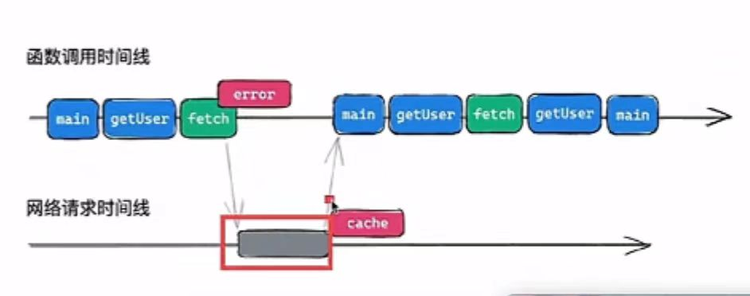
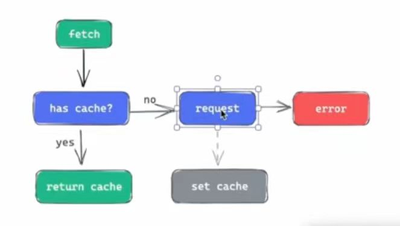

# 消除异步的传染性

如下所示的代码片段中，由于 `getUser` 是个异步的函数，导致一系列调用链上的本来可以写成纯函数的函数都得写成异步函数，引入了副作用。在一般的业务环境下没什么太大的影响，但是如果在函数式编程中，影响就比较大，函数式编程中尽可能要让函数是纯函数。

现在要求将调用链中函数的 `async` 都去掉，同时保证功能正常。

```js
async function getUser() {
  return await fetch("./1.json");
}

async function m1() {
  const user = await getUser();
  // other works
  return user;
}

async function m2() {
  const user = await m1();
  // other works
  return user;
}

async function m3() {
  const user = await m2();
  // other works
  return user;
}

async function main() {
  const user = await m3();
  console.log(user);
}
```

## 思路：

1. 把 fetch 改掉，遇到 fetch 时，直接抛出错误，让调用栈结束
2. 抛出错误的同时，发出这个网络请求，通过结束后，缓存其结果
3. 重启执行 main 函数，再去调用 getUser 中的 fetch。此时，有缓存，会直接返回结果

### 疑问：这种方式会让 main 函数会被调用两次，会不会有问题？

因为是函数式编程环境，它是纯函数，没有副作用，调用次数不会影响结果。

### 整个过程



## fetch 的逻辑



## 代码实现

1. **改动 fetch**
2. **运行 func**
3. **恢复之前的 fetch**

```js
// 模拟 fetch
function fetch() {
  return new Promise((resolve, reject) => {
    setTimeout(() => {
      resolve({
        name: "Will",
      });
    }, 300);
  });
}

function getUser() {
  return window.fetch("./1.json");
}

function m1() {
  const user = getUser();
  // other works
  return user;
}

function m2() {
  const user = m1();
  // other works
  return user;
}

function m3() {
  const user = m2();
  // other works
  return user;
}

function main() {
  console.log("==main调用了==");
  const user = m3();
  console.log("==user==", user);
}

function run(func) {
  // 1. 改动 fetch
  const originFetch = fetch;

  // TODO: 需要支持多缓存
  const cache = {
    status: "pending", // fulfilled、rejected
    data: null,
    err: null,
  };

  function newFetch(...args) {
    if (cache.status === "fulfilled") {
      return cache.data;
    } else if (cache.status === "rejected") {
      throw cache.err;
    }

    // TODO: 不一定是 json 格式
    const p = originFetch(...args)
      // 由于是模拟 fetch，没有提供 json 方法，这里暂时注释掉
      // .then((res) => res.json())
      .then((data) => {
        cache.status = "fulfilled";
        cache.data = data;
      })
      .catch((err) => {
        cache.status = "rejected";
        cache.err = err;
      });

    // 抛出指定的错误，用于后续捕获处理
    throw p;
  }

  window.fetch = newFetch;

  // 2. 运行 func
  try {
    // 这里报错，说明正在进行请求
    func();
  } catch (err) {
    if (err instanceof Promise) {
      // 请求结束后，重新运行 func 函数
      err.finally(() => {
        window.fetch = newFetch;
        func();
        window.fetch = originFetch;
      });
    }
  }

  // 3. 恢复之前的 fetch
  window.fetch = originFetch;
}

run(main);
```

**_[视频讲解](https://www.douyin.com/search/%E6%B8%A1%E4%B8%80%E5%89%8D%E7%AB%AF%E5%BF%85%E4%BF%AE%E8%AF%BE_%E6%B6%88%E9%99%A4%E5%BC%82%E6%AD%A5%E7%9A%84%E4%BC%A0%E6%9F%93%E6%80%A7)\_**

# 延升

`React` 中的 `Suspense` 可以接受一个 `fallback`，用于其中的组件在加载时的占位，当组件加载完成后，占位元素被替换成组件。
我们一般是将其包裹在使用了 `React.Lazy` 方法的组件外部，用于懒加载时的占位。其实也可以用于包裹内部有异步接口请求的组件，如下：

```html
<Suspense fallback={<p>loading...</p>}>
  <Todos />
</Suspense>
```

```js
// Todo 组件

import { getUser } from "api/fetch-data";

const resource = getUser();

const Todo = () => {
  console.log("==组件渲染了==");

  // 这里没有使用异步，而是用同步的方式进行错误抛出
  const userDetails = resource.read(); // 这里抛出异常

  return <div>Todo</div>;
};
```

## 但是 Suspense 是怎么知道组件什么时候加载完的呢？

1. 同上述的 run 放法，组件中没有使用异步的方式，而是抛出异常，同时发起请求
2. Suspense 中捕获 promise 异常，在请求完成之前，渲染 fallback
3. 等 Promise 完成之后，Suspense 会重新运行包裹的组件

## 怎么证明？

1. 在组件中打印日志，会发现打印了两次。
2. 如果直接在组件抛出 Promise，后边的代码都不会运行了。将一直渲染 fallback

```js
// Todo 组件

import { getUser } from "api/fetch-data";

const resource = getUser();

const Todo = () => {
  throw Promise.resolve();

  // 这里没有使用异步，而是用同步的方式进行错误抛出
  const userDetails = resource.read(); // 这里抛出异常

  return <div>Todo</div>;
};
```
